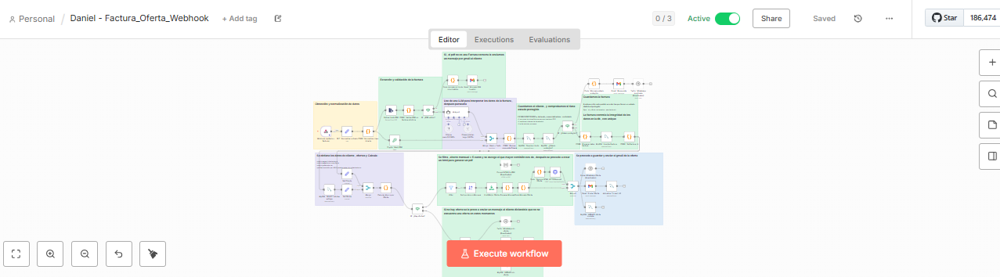
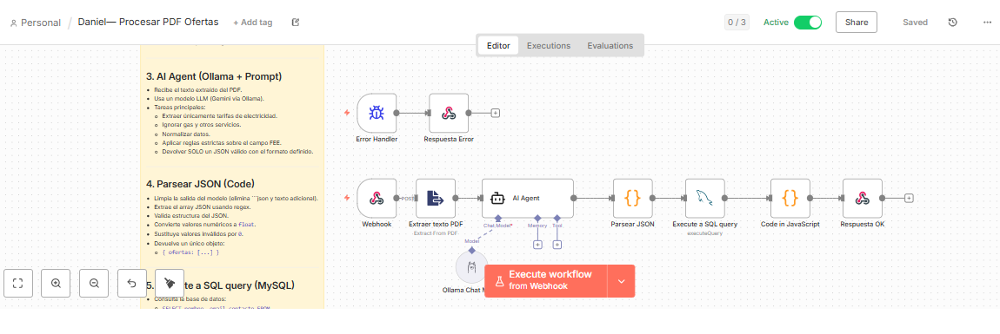
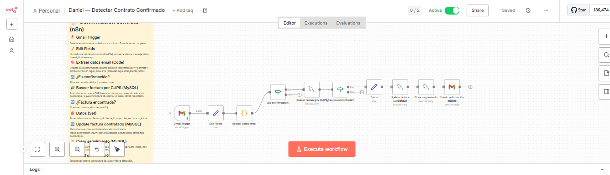
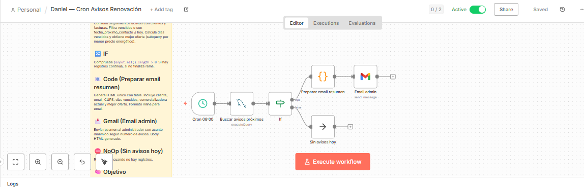
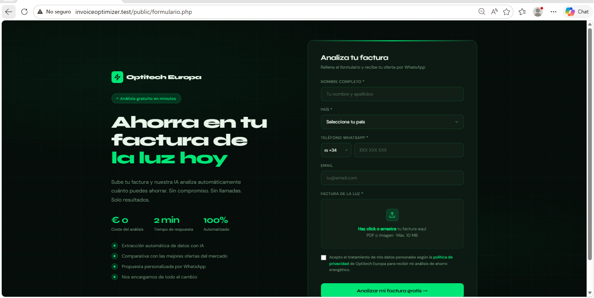

<div align="center">

# InvoiceOptimizer AI

### AI-Powered Energy Automation Platform

<br>


<br>

Plataforma inteligente de automatización para análisis de facturas eléctricas, comparación de tarifas y gestión automatizada del ciclo de contratación.

</div>

---

# Tabla de contenidos

- [Visión general](#-visión-general)
- [Problema que resuelve](#-problema-que-resuelve)
- [Características principales](#-características-principales)
- [Arquitectura](#-arquitectura)
- [Flujo completo del sistema](#-flujo-completo-del-sistema)
- [Motor de IA](#-motor-de-ia)
- [Workflows n8n](#-workflows-n8n)
- [Panel de administración](#-panel-de-administración)
- [Modelo de datos](#-modelo-de-datos)
- [Stack tecnológico](#-stack-tecnológico)
- [Instalación](#-instalación)
- [Variables de entorno](#-variables-de-entorno)
- [Estructura del proyecto](#-estructura-del-proyecto)
- [Screenshots](#-screenshots)
- [Roadmap](#-roadmap)
- [Estado actual](#-estado-actual)

---

# 🚀 Visión general

InvoiceOptimizer AI es una plataforma de automatización empresarial desarrollada para brokers de energía eléctrica.

El sistema automatiza completamente:

- Recepción de facturas
- Extracción inteligente de datos
- Comparación de facturas con las ofertas
- Gestión de consentimiento
- Seguimiento comercial
- Renovaciones automáticas

La plataforma está diseñada bajo una arquitectura orientada a automatizaciones, donde **n8n actúa como motor central de orquestación**, mientras que PHP y MySQL gestionan persistencia, supervisión y lógica administrativa.

---

# 🎯 Problema que resuelve

En muchas comercializadoras energeticas, el proceso comercial todavía es manual:

- Analizar facturas manualmente
- Comparar tarifas en Excel
- Enviar ofertas una por una
- Esperar respuestas manuales
- Gestionar seguimientos sin automatización

Esto genera:

- Baja escalabilidad
- Alto coste operativo
- Errores humanos
- Pérdida de oportunidades
- Procesos lentos

InvoiceOptimizer AI automatiza todo el ciclo operativo usando IA local y workflows inteligentes.

---

# ✨ Características principales

## 📄 Procesamiento inteligente de facturas

- Extracción automática desde PDFs
- Detección de CUPS
- Consumos por periodo
- Potencias contratadas
- Comercializadora actual
- Parsing estructurado con IA local

---

## 🧠 IA local integrada

Uso de:

- Ollama
- Gemma

Sin dependencia de APIs externas.

La IA se utiliza para:

- Extraer datos estructurados
- Clasificar respuestas
- Interpretar documentos
- Detectar intención del cliente

---

## ⚡ Comparador automático de tarifas

El sistema:

- Calcula costes reales
- Simula consumo mensual
- Detecta ahorro
- Selecciona automáticamente la mejor oferta

### Reglas de negocio

1. Prioridad absoluta al ahorro del cliente
2. Optimización secundaria de comisión empresarial

---

## 📧 Comunicación automatizada

Integraciones:

- Gmail API
- Twilio WhatsApp

Capacidades:

- Envío automático de ofertas
- Solicitud de consentimiento
- Respuestas automáticas
- Notificaciones internas

---

## 🔄 Renovaciones automáticas

El sistema programa seguimientos automáticamente:

- Cron diario
- Detección de renovaciones
- Reapertura automática del ciclo comercial
- Emails internos de aviso

---

# 🏗 Arquitectura

```text
                          ┌─────────────────────┐
                          │      Cliente        │
                          └──────────┬──────────┘
                                     │
                                     │ Subida factura PDF
                                     ▼
                    ┌────────────────────────────────┐
                    │              n8n               │
                    │     Workflow Automation Hub    │
                    └──────────┬──────────┬──────────┘
                               │          │
                 ┌─────────────┘          └─────────────┐
                 ▼                                      ▼

       ┌──────────────────┐                 ┌──────────────────┐
       │   Ollama + AI    │                 │ Gmail / Twilio   │
       │ Gemma Local LLM  │                 │ Communication APIs│
       └────────┬─────────┘                 └────────┬─────────┘
                │                                     │
                └─────────────────┬───────────────────┘
                                  ▼

                    ┌────────────────────────────────┐
                    │        MySQL + Aiven           │
                    │     Central Business DB        │
                    └────────────────┬───────────────┘
                                     ▼

                    ┌────────────────────────────────┐
                    │     PHP Admin Dashboard        │
                    │ Monitoring & Management Panel  │
                    └────────────────────────────────┘
```

---

# 🔁 Flujo completo del sistema

## 1. Recepción de factura

El cliente sube un PDF desde un formulario web.

Esto activa automáticamente un webhook en n8n.

---

## 2. Extracción con IA

El sistema:

- Extrae texto del PDF
- Envía contenido a Ollama
- Genera JSON estructurado

Datos obtenidos:

- CUPS
- Consumos
- Potencias
- Comercializadora
- Tarifas

---

## 3. Comparación de ofertas

La lógica compara automáticamente:

- Tarifas disponibles
- Consumo real
- Coste mensual
- Coste anual
- Comisión empresarial

---

## 4. Generación de oferta

El sistema genera automáticamente:

- HTML dinámico
- Estimación ahorro
- Oferta personalizada
- Solicitud de consentimiento

---

## 5. Consentimiento del cliente

El cliente puede responder:

- Por email
- Por WhatsApp

La IA clasifica automáticamente:

- SÍ
- NO
- Consulta
- Ambigüedad

---

## 6. Contratación

Cuando la comercializadora confirma:

- Se detecta el email
- Se actualiza estado
- Se crea seguimiento
- Se notifica internamente

---

## 7. Renovación automática

Un cron diario:

- Detecta contratos próximos
- Busca mejores tarifas
- Genera avisos automáticos

---

# 🧠 Motor de IA

## IA Local

```text
Ollama + Gemma
```

## Funciones implementadas

| Función | Descripción |
|---|---|
| Parsing PDF | Extracción estructurada |
| Clasificación intención | Detectar respuestas cliente |
| Procesamiento semántico | Interpretar mensajes |
| Parsing tarifas | Extraer ofertas desde PDFs |

---

# 🔄 Workflows n8n

## Factura_Oferta_Webhook

Workflow principal del sistema.

### Funciones

- Procesamiento factura
- Extracción IA
- Comparación tarifas
- Generación oferta
- Envío email
- Registro BD

---

## Procesar PDF Ofertas

Automatiza actualización de tarifas.

### Funciones

- Leer PDFs comercializadoras
- Extraer tarifas
- Normalizar datos
- Insertar en MySQL

---

## Consentimiento Si/No

Gestiona respuestas del cliente.

### Funciones

- Clasificación IA
- Actualización estados
- Automatización contratación

---

## Detectar Contrato Confirmado

Monitoriza emails automáticamente.

### Funciones

- Detectar contratación
- Extraer CUPS
- Actualizar estado
- Crear seguimiento

---

## Cron Avisos Renovación

Sistema automático de renovaciones.

### Funciones

- Detectar renovaciones próximas
- Buscar mejores ofertas
- Enviar avisos internos

---

# 🖥 Panel de administración

Dashboard desarrollado en PHP para:

- Supervisión de clientes
- Gestión de ofertas
- Seguimiento contratos
- Estados del sistema
- Renovaciones
- Monitorización operativa

---

# 🗄 Modelo de datos

## Tablas principales

| Tabla | Descripción |
|---|---|
| `clientes` | Información cliente |
| `facturas` | Facturas y consumos |
| `ofertas` | Tarifas energéticas |
| `seguimientos` | Renovaciones |
| `usuarios` | Acceso administrador |

---

## Reglas de integridad

### Protección de estados

Estados críticos nunca se sobrescriben:

- `oferta_enviada`
- `derivado_comercializadora`
- `contratado`

---

### Prevención duplicados

Uso de:

```sql
ON DUPLICATE KEY UPDATE
```

---

# ⚙ Stack tecnológico

| Tecnología | Rol |
|---|---|
| PHP | Backend dashboard |
| MySQL | Base de datos |
| Aiven | Hosting MySQL |
| n8n | Automatización |
| Ollama | IA local |
| Gemma | Modelo LLM |
| Gmail API | Emails |
| Twilio | WhatsApp |
| Composer | Dependencias |
| phpdotenv | Variables entorno |

---

# 📦 Instalación

## Clonar repositorio

```bash
git clone https://github.com/tu-usuario/invoiceoptimizer-ai.git
cd invoiceoptimizer-ai
```

---

## Instalar dependencias

```bash
composer install
```

---

## Configurar entorno

```bash
cp .env.example .env
```

---

## Iniciar Ollama

```bash
ollama run gemma
```

---

# 🔐 Variables de entorno

```env
# Database
DB_HOST=
DB_PORT=
DB_NAME=
DB_USER=
DB_PASS=
DB_SSL=true

# App
APP_ENV=local
```

---

## 📸 Screenshots

# 🖥 Panel de administración

<table>
  <tr>
    <td align="center" width="50%">
      
      <br />
      <sub><b>Dashboard principal</b></sub>
    </td>
    <td align="center" width="50%">
      
      <br />
      <sub><b>Gestión de clientes</b></sub>
    </td>
  </tr>
  <tr>
    <td align="center">
      
      <br />
      <sub><b>Gestión de ofertas</b></sub>
    </td>
    <td align="center">
      
      <br />
      <sub><b>Comercializadoras</b></sub>
    </td>
  </tr>
  <tr>
    <td align="center">
      
      <br />
      <sub><b>Sistema de avisos</b></sub>
    </td>
    <td align="center">
      
      <br />
      <sub><b>Gestión de usuarios</b></sub>
    </td>
  </tr>
  <tr>
    <td align="center">
      
      <br />
      <sub><b>Perfil de usuario</b></sub>
    </td>
    <td align="center">
      
      <br />
      <sub><b>Pantalla de login</b></sub>
    </td>
  </tr>
</table>


---

# 🔄 Workflows n8n

<table>
  <tr>
    <td align="center" width="50%">
      
      <br />
      <sub><b>Factura Oferta Webhook</b></sub>
    </td>
    <td align="center" width="50%">
      
      <br />
      <sub><b>Procesar ofertas PDF</b></sub>
    </td>
  </tr>
  <tr>
    <td align="center">
      
      <br />
      <sub><b>Consentimiento Sí/No</b></sub>
    </td>
    <td align="center">
      
      <br />
      <sub><b>Detectar contrato confirmado</b></sub>
    </td>
  </tr>
  <tr>
    <td align="center">
      
      <br />
      <sub><b>Cron avisos renovación</b></sub>
    </td>
    <td align="center">
    </td>
  </tr>
</table>

---

# 🌐 Frontend público

<table>
  <tr>
    <td align="center" width="100%">
      
      <br />
      <sub><b>Formulario de subida de factura</b></sub>
    </td>
  </tr>
</table>


# 👨‍💻 Autor

**Daniel**  
Proyecto personal de automatización empresarial e inteligencia artificial aplicada al sector energético.

---

# 📄 Licencia

Este proyecto está desarrollado con fines educativos, técnicos y demostrativos.
